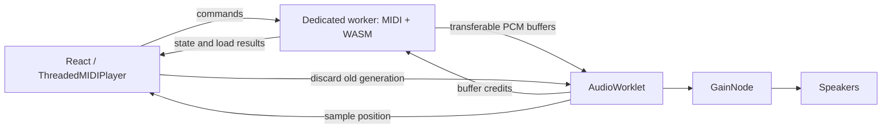

# MIDI playback threading

The main thread owns React, user controls, and a cached playback state. A dedicated
worker owns MIDI parsing/sequencing, soundfonts, and the Emscripten/WASM synth.
An AudioWorklet consumes stereo PCM from that worker through a direct MessagePort.
The main thread never replenishes PCM or schedules individual MIDI notes.



Implementation steps:

1. Commit the pre-existing drum-note click change (`41137b40a`).
2. Make the existing synth and sequencer usable in a worker, including the checked-in
   Emscripten wrapper and the `web,worker` flag for future WASM rebuilds.
3. Add the direct worker/worklet channel and bounded audio queue.
4. Replace the App's ScriptProcessor callback with the synchronous UI facade.
5. Preserve controls, arrangement exclusions, drum overrides, transposition,
   tempo, custom soundfonts, and playback position reporting.
6. Provide protocol checks and browser acceptance checks below. Verification is
   left to the user per AGENTS.md; no server/build/test was run during the refactor.

## Responsiveness and ordering

The worklet requests at most four 512-frame blocks, counting both queued blocks
and requests in flight. That is 42.7 ms at 48 kHz or 46.4 ms at 44.1 kHz. Mute,
solo, tempo, and transpose changes apply to subsequent blocks without interrupting
unaffected voices. Channel mute also sends All Sound Off for sustained/releasing
voices. Unmute lets subsequent note-on events sound; it does not reconstruct
already-muted notes.

Pause/stop, seek, track changes, and explicit soundfont changes invalidate the
old output generation directly from the UI. The worklet discards queued samples
and rejects old messages. A matching worker reset starts the new generation;
message ordering across the two ports cannot discard an already-started matching
generation. Samples already handed to the device cannot be recalled. Device and
browser output latency is additional to the queue latency.

Playback starts once two blocks arrive. The worker serializes asynchronous loads
and controls. Loading a new MIDI or font can take longer than ordinary controls;
stopping remains immediate at the output while the worker finishes loading.
A UI click cannot execute while the main thread itself is blocked, but ongoing
audio no longer depends on that thread making progress.

The playhead uses timestamps from consumed PCM and AudioContext.currentTime;
it does not use worker render-ahead or a wall-clock timer. Natural completion
waits for queued release tails to drain. During worker starvation the worklet
outputs silence, freezes its reported position, counts an underrun, and buffers
again. `?debug=timing` logs changes to the underrun counter.

The larger default font is downloaded in the background; filesystem copies,
persistence, and synth loading wait for the next track. It never automatically
replaces the playing synth. Explicit font replacement
intentionally flushes output while loading. An unavailable AudioWorklet produces
an error; there is no main-thread synthesis fallback. No SharedArrayBuffer or
cross-origin isolation headers are required.

## User verification

Run the deterministic queue/protocol checks:

```sh
node scripts/rawl/check-midi-output.cjs
```

Use the existing server at http://localhost:3000 (the agent must not start it):

1. Load a multivoice MIDI with `?debug=timing`. Check initial playback, a track
   loaded paused, pause/resume, stop/restart, and natural completion/restart.
2. Repeatedly solo/mute voices, including held notes with sustain. The change
   should be audible within roughly 50 ms plus device latency after the click
   handler runs, with other voices continuing uninterrupted.
3. Seek forwards/backwards while playing and paused. Rapidly switch tracks and
   alternate seek/pause/play. No old audio should appear after a transition.
4. Change tempo and transpose, apply drum overrides and saved exclusions, and
   load a dropped SF2. Check the editor's playback-start callback and playhead.
5. While a track plays, run this in the browser's **main-page** console:

   ```js
   const until = performance.now() + 2000;
   while (performance.now() < until) {}
   ```

   The UI will freeze for two seconds. Audio should continue, and the playhead
   should catch up afterwards. The underrun count should not increase solely
   because the UI was blocked. Repeat while scrolling/rendering a dense score.
6. Check Chrome, Firefox, and Safari, backgrounding/foregrounding the tab, and
   context suspension/resumption. Inspect the Network panel for the worker,
   worklet, WASM, and soundfont assets, including on the deployment's base URL.

The bounded queue trades some worker scheduling tolerance for control latency.
Worker CPU exhaustion, memory pressure, browser suspension, and device/OS limits
can still interrupt audio. These checks are needed before making a measured
latency or glitch-free claim for a particular browser/device.
