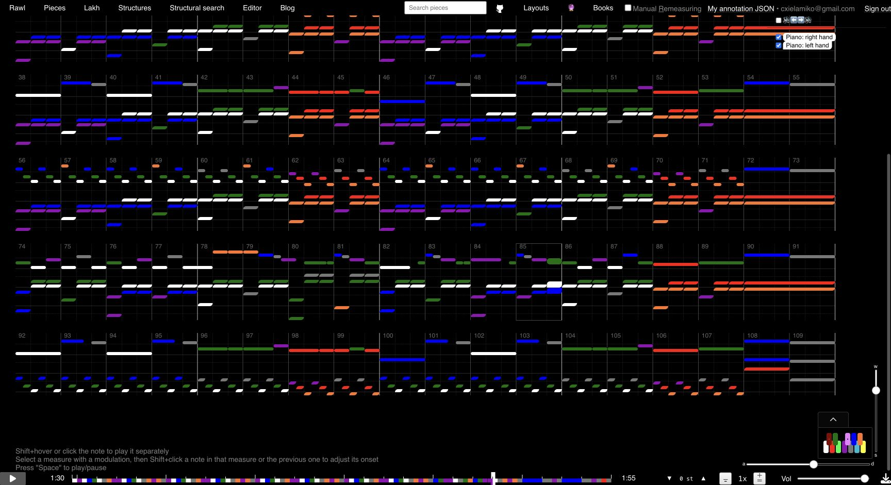

# Applied harmony corrections

Applied to Firebase and the local dump on 2026-10-04. Backups were saved first in `backup_midis/2026-10-04T19-57-11-515Z-gibran-harmony-fix/`: all 15 live originals, the 11 existing local JSON files, and the local index.

| Piece | Changed notes | Correction |
|---|---:|---|
| Idea 1 | 48 | Repeated B3 to A♯3 accompaniment motif; B3 to E3 in measures 35–36; C♯4 to D♯4 in 39–40 and 47–48. |
| Idea 2 | 29 | Revoiced the complete four-bar ending, measures 73–76, as E major → C♯ minor → G♯ minor → G♯ minor, using the existing arpeggio rhythm. Exact release voicing is less certain than the harmony. |
| Idea 8 | 6 | Four repeated B♭3 notes to A3 in measure 33; bass G2 to B♭2 and inner G3 to F3 in measure 58. |
| Idea 15 | 39 | Complete accompaniment blocks in 74–77 and 82–85 changed from F♯ → A to A → F♯; 80–81 changed to E major. Valid B block in 88–89 retained. |

Idea 1's corrected motif occurs in measures 23–24, 31–32, 59–60, 67–68, 93–94, 101–102, 109–110, 117–118 and 125–126. The automatic audit also flagged 119 and 127, but harmonic-context review established these as valid E-major bars, so they remain unchanged.

122 note pitches changed. Every note onset, duration, velocity, track, tempo, signature and non-pitch event is preserved. Repeated accompaniment motifs were corrected consistently; the entire ending was revoiced together. No isolated replacement texture was inserted.

Only the four listed Firebase blobs changed. All 15 local blobs were verified byte-identical to Firebase afterward. Four previously missing local entries (Ideas 2, 8, 12 and 19) were added to the dump and index. The transaction checked original hashes before writing; metadata was preserved.

Ideas 19 and 20 retain their existing forms because form differences did not establish reliable pitch corrections. The other nine entries, including alternate versions, had no confirmed harmonic correction to apply.

## Validation and evidence

- MIDI event comparisons confirmed unchanged timing, non-pitch events and note counts, with paired note-on/off edits.
- All four improved full pitch-class support against Transkun. These diagnostic scores do not establish exact voicing or accuracy; post-fix comparisons are in `post-fix/`.
- Fresh Chrome loads rendered and played Ideas 1, 2, 8 and 15, including seeking to corrected passages and playing Idea 2 through its ending. No compile errors or observed playback failures. Idea 15 emitted the existing `InlineSnippets` React missing-key warning; the other three had no warning/error console output.
- `corrections.json` lists every changed note and before/after hashes. `corrected/` contains published MIDIs. `publish-result.json` records all live/local hashes and the backup location. `fix-midis.py` records reproducible pitch edits.

## Original versions for comparison

On 2026-10-05, the exact four backed-up originals were uploaded under their source slugs plus _backup. Full current annotations were copied to Firebase and checked-in analysis data. The local MIDI dump and index include these versions. Original hashes and annotation values were verified; existing annotations and corrected MIDI versions were preserved.

| Piece | Corrected | Original backup |
|---|---|---|
| Idea 1 | [Corrected](http://localhost:3000/f/idea-1---gibran-alcocer) | [Original](http://localhost:3000/f/idea-1---gibran-alcocer_backup) |
| Idea 2 | [Corrected](http://localhost:3000/f/idea-2---gibran-alcocer) | [Original](http://localhost:3000/f/idea-2---gibran-alcocer_backup) |
| Idea 8 | [Corrected](http://localhost:3000/f/idea-8---gibran-alcocer) | [Original](http://localhost:3000/f/idea-8---gibran-alcocer_backup) |
| Idea 15 | [Corrected](http://localhost:3000/f/idea-15---gibran-alcocer) | [Original](http://localhost:3000/f/idea-15---gibran-alcocer_backup) |

Chrome checks: all four backup scores rendered with annotations and play/pause controls worked. Ideas 1, 2 and 8 had no console warnings/errors; Idea 15 retained the existing InlineSnippets missing-key warning. No compile errors. Publication IDs, hashes and annotations are recorded in backup-versions-published.json.
