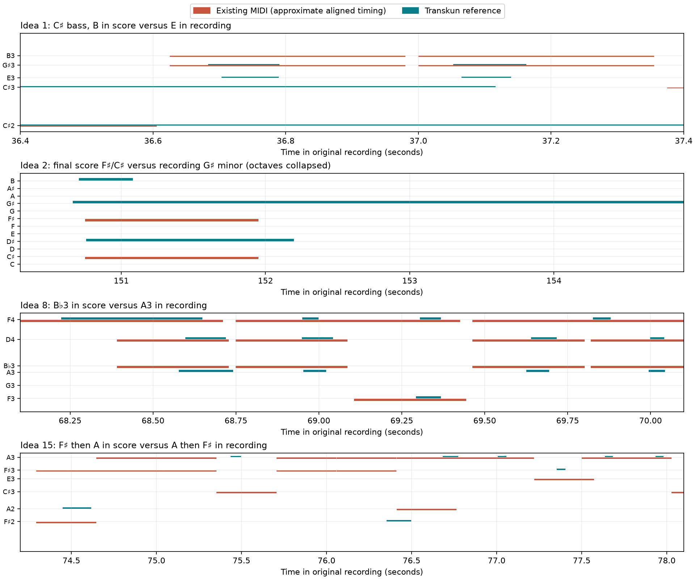

# Gibran Alcocer: MIDI harmony audit

Audit date: 2026-10-04. Checked **all 15 current Rawl corpus entries against 13 original recordings**, using `yt-dlp -x` and the installed Transkun 2.0 model. Original audit snapshots were fetched read-only. Confirmed corrections were subsequently applied after backups were saved. See [applied fixes](FIXES.md).

**Prioritize Idea 1, Idea 15, Idea 8, and Idea 2.** Their scores contain harmonic differences supported by both the independent transcription and local audio-spectrum checks. Idea 19 needs a separate form/repeat review before it can be treated as a complete transcription of the release.

## Actionable findings

Measure numbers below come from the source MIDI's time signatures, with measure 1 at tick 0. Recording timestamps are the easiest way to locate the corresponding music. Enharmonic names are chosen for the music, even though the JSON uses flat pitch-class names.

| Idea | Source measures / recording time | Existing MIDI | Recording evidence | Assessment |
|---|---|---|---|---|
| **1** | **23–24**, 31–32 and later repetitions; representative **0:24–0:25** | Repeated LH **B3–D♯4** over B/F♯ bass | Repeated **A♯3–D♯4**. Both Transkun and the spectrum show A♯3 distinctly from the B bass. | Replace the repeated upper B with A♯ in this motif; the major seventh matters harmonically. Later candidate repetitions are listed below. |
| **1** | **35–36**; **0:36.6–0:37.3** | **G♯3–B3** over C♯ bass | **E3–G♯3** over C♯ bass. Spectral fit: B pitch-class salience 0.007 versus E 0.647, relative to the strongest class. | The recording supplies the minor third E; the score substitutes the seventh B. |
| **1** | **39–40 and 47–48**; representative **0:40.85–0:41.45** | Repeated **A♯3–C♯4** over F♯ bass | Repeated **A♯3–D♯4** over F♯ bass. Spectral fit: C♯ 0.020 versus D♯ 0.406. | Replace C♯4 with D♯4 in these passages. This changes the chord's pitch set, not just its octave. |
| **15** | **74–77 and 82–85**; **1:14.45–1:18.24**, **1:22.02–1:25.78** | Bass sequence **F♯ → A** | **A → F♯**, twice. Low A2 and F♯2 attacks and spectral fits agree. The accompaniment also changes: A uses C♯/E, F♯ uses A/C♯. | The score carries the earlier cycle into a reprise where the recording changes the harmony. Swap the two harmonic blocks, including their accompaniment, rather than changing only the bass. |
| **15** | **80–81**; **1:20.12–1:22.02** | B-bass / B-major-derived block, including D♯ | **E-major** block: E3, G♯4, B3 and E4. Spectrum supports E/G♯/B; D♯ is weak. | Replace this block with the recording's E harmony. |
| **8** | **33**; **1:08.2–1:10.1** | Four repeated **B♭3** notes with D4 over F bass | Four repeated **A3** notes with D4 over F bass. Spectral fit: A 0.441 versus B♭ 0.118; A3 is a prominent fitted pitch. | Change B♭3 to A3 here: the recorded pitch set is D minor over F, not the score's B♭-derived harmony. |
| **8** | **58**; **2:01.56–2:03.6** | Bass **G2**, followed by G3 | Bass **B♭2**, followed by **F3**. Upper B♭/D agrees. Spectrum strongly supports B♭/D/F; G is weak. | Change the bass G2 to B♭2 and the subsequent LH G3 to F3. This passage repeats the B♭ harmony, rather than changing to G minor. |
| **2** | **76**, with the preceding coda **73–75** worth revising together; **2:30.66–2:35** | Final F♯/C♯ dyad, with very high octave doubling | Release ends on **G♯ minor: G♯–B–D♯**. Transkun and the final spectrum agree; F♯/C♯ are negligible. | The final score chord differs clearly. Review the entire four-bar coda: the score also includes unsupported B/D♯ additions over the earlier E-based ending. Exact coda timing/voicing is less certain than the final harmony. |

For Idea 1's B3 → A♯3 motif, exact-pitch event matching additionally flags source measures **59–60, 67–68, 93–94, 101–102, 109–110, 118–119, and 126–127**. These are candidate repetitions of the same error; the independent spectral spot checks cover approximately 0:24, 1:02, 1:39, and 1:55. Later form changes can affect automatic alignment, so use the timestamps and note-level evidence when editing.

### Form and arrangement limitations

- **Idea 19:** the score's notes end at 130.31s, while Transkun follows the release to 197.47s (the source audio is 207s including decay). Most of the first 110s align approximately one-to-one; the late score is forced across much more reference music. Its final A-minor chord does not match the release's G-major ending at approximately 3:15–3:18. The score may be a shortened arrangement. Its late low agreement cannot all be labeled wrong chords without reconstructing the omitted/rearranged sections.
- **Idea 20:** repeated sections cause a local alignment jump. For example, source measure 65's G harmony matches the recording around 1:11, although unconstrained global DTW incorrectly maps it into the A♭ section around 1:16. That automatic flag was **rejected**. The score and release differ in length/form; no independently confirmed harmonic correction is claimed here.
- **Idea 25:** the corpus explicitly contains a piano-solo arrangement. Its comparison to the original Alcocer/Vanzo release is useful for harmony, but instrumental/voicing differences do not establish transcription errors.
- **Idea 22 abridged:** missing sections are expected. Its lower reference coverage measures its shorter form, not harmonic accuracy.
- **Idea 15 Basic Pitch:** this is an independent automated version with a default MIDI time grid. Its broad pitch-class and reference bass coverage are strong; it should not inherit the manually notated version's reprise blocks automatically.

## Coverage of the whole corpus

The percentages below are **diagnostic pitch-class support, not accuracy or probability of correctness**. A score note is supported if the same pitch class occurs around its aligned time, or is sustained there in Transkun. This deliberately tolerates octave, tempo, pedal and voicing differences. It can also hide wrong bass roots or wrong chord tones when the same class occurs in the melody—Idea 15 is an example. The actionable review above takes precedence over these numbers.

| Entry | Score pitch-class support | Score lower-register support | Finding |
| Idea 1 | 94.9% | 93.8% | Repeated accompaniment/chord-tone errors; revise. |
| Idea 2 | 97.8% | 98.5% | Main sections broadly supported; final harmony differs. |
| Idea 5 | 97.5% | 95.5% | Broadly supported; no spectrally confirmed harmonic error found. |
| Idea 7 | 99.4% | 99.8% | Very strong agreement; tempo differs considerably. |
| Idea 8 | 94.6% | 92.2% | Two confirmed harmonic passages need correction. |
| Idea 9 | 98.1% | 93.3% | Broadly supported; bass omissions in Transkun limit exact checks. |
| Idea 10 | 100.0% | 100.0% | Strongest pitch-class support; no substantial harmonic flag. |
| Idea 12 | 98.0% | 99.4% | Strong agreement. A suspected m46 bass error was rejected: spectrum supports the score's low C♯ despite Transkun missing it. |
| Idea 15 | 98.5% | 97.2% | Reprise bass order and one harmonic block differ. |
| Idea 15 (Basic Pitch) | 98.3% | 97.5% | Broad harmonic support; no notated reprise correction is applied to this variant. |
| Idea 19 | 89.6% | 81.4% | Shorter/different late form; full-release harmony verification remains limited. |
| Idea 20 | 98.5% | 96.5% | Broad agreement; form/repeat alignment caveat. |
| Idea 22 | 98.2% | 97.6% | Strong agreement for the full score; no confirmed harmonic error found. |
| Idea 22 (abridged) | 97.2% | 97.9% | Retained material broadly agrees; omissions are intentional. |
| Idea 25 (solo arrangement) | 96.9% | 96.4% | Broad harmony agreement for the named solo arrangement. |

## Reference recordings

All references were selected from the composer's official release channel or its original Kurate Music releases. No covers, slowed versions, orchestral alternatives or vocal remixes were used.

- [Idea 1 — Idea 1](https://www.youtube.com/watch?v=HagoDidoFMw)
- [Idea 2 — Gibran Alcocer - Idea 2 (Official Visualizer)](https://www.youtube.com/watch?v=aroY4ak2lb8)
- [Idea 5 — Gibran Alcocer - Idea 5](https://www.youtube.com/watch?v=Gjx3xW8swlk)
- [Idea 7 — Gibran Alcocer - Idea 7 (Official Visualizer)](https://www.youtube.com/watch?v=neY7-zLNp6I)
- [Idea 8 — Idea 8](https://www.youtube.com/watch?v=PwAYyEE33Xk)
- [Idea 9 — Gibran Alcocer - Idea 9](https://www.youtube.com/watch?v=zdztQg038yc)
- [Idea 10 — Gibran Alcocer - Idea 10](https://www.youtube.com/watch?v=5OIeIaAhQOg)
- [Idea 12 — Gibran Alcocer - Idea 12 (Official Visualizer)](https://www.youtube.com/watch?v=_UUArHUUiq8)
- [Idea 15 — Gibran Alcocer - Idea 15](https://www.youtube.com/watch?v=hyUct2htiNk)
- [Idea 19 — Idea 19](https://www.youtube.com/watch?v=O7jU0kxp9x4)
- [Idea 20 — Gibran Alcocer - Idea 20](https://www.youtube.com/watch?v=RPEDJXBDMjo)
- [Idea 22 — Idea 22](https://www.youtube.com/watch?v=8Da7RgPXCmU)
- [Idea 25 — Gibran Alcocer, Andrea Vanzo - Idea 25](https://www.youtube.com/watch?v=pYOEIzm_kuM)

## Representative pitch comparisons



## Method and evidence

1. Read the current `gibran_alcocer` corpus slugs and fetched those 15 MIDI documents from Firebase without writing to the database. The included `existing/` snapshot and SHA-256 hashes identify exactly what was checked.
2. Resolved the original releases with `yt-dlp`, then extracted their audio with `yt-dlp -x --audio-format wav --write-info-json`. The selected IDs and URLs are in `sources.json`. Downloaded audio and full yt-dlp metadata/logs remain at `/private/tmp/rawl-gibran-audit/audio/` and `/private/tmp/rawl-gibran-audit/download.log`.
3. Ran the installed `transkun` CLI using its bundled **2.0 model**, CPU, with four computation threads per process. All 13 transcriptions exited successfully. Transkun emitted Python/PyTorch deprecation and inference warnings, but no transcription failure. The 13 independent MIDIs are in `transkun/`; they are reference estimates, not approved replacements.
4. Parsed MIDI tempo and signature events across merged tracks. Aligned 0.25s pitch-class profiles using DTW, with lower-register information and a gap penalty. Capped note tails for alignment, then checked pitch-class support in both directions. Audited low-bass attacks separately because chord-class agreement can conceal a wrong root or inversion. `compare.py` and `root-check.py` document the diagnostic logic; `comparisons/` contains every score note, aligned recording time, nearby Transkun pitches, and per-measure flags.
5. Reviewed systematic chord-tone/root discrepancies, and independently inspected selected recording intervals with STFT plus a nonnegative harmonic-template spectral fit. This fit is approximate—it is not a second ground-truth transcription—but it distinguished the disputed pitch sets from simple Transkun omissions. The `spectral-evidence*.json` files retain relative pitch-class salience and prominent fitted pitches. `spectrum.py` documents the calculation.
6. Opened the current Idea 8 score in Chrome on the user's existing `http://localhost:3000` server and checked its displayed source and fresh browser console. The source matched the audited Firebase document; no console errors or warnings were returned. No app code, saved analysis, or source MIDI was changed.

### Reproduce the main commands

```sh
yt-dlp --no-cache-dir --js-runtimes node -x --audio-format wav \
  --write-info-json --no-playlist -o 'audio/%(id)s.%(ext)s' URL
OMP_NUM_THREADS=4 transkun audio.wav reference.mid
```

The analysis scripts expect the temporary audit root `/private/tmp/rawl-gibran-audit`; the saved snapshots and reference MIDIs are also included here for review. `summary.json` stores both-direction support and all per-measure windows. `checksums.json` identifies the MIDI snapshots. `harmonic-differences.png` shows representative pitch comparisons; score timing in that plot is approximate DTW alignment.

These are evidence-based harmonic flags, not a claim that every note was verified by ear. Quiet notes, sub-bass, pedal, doubles, rubato, repeats and arrangement differences limit automation. No changes were uploaded, and no existing MIDI was overwritten.
